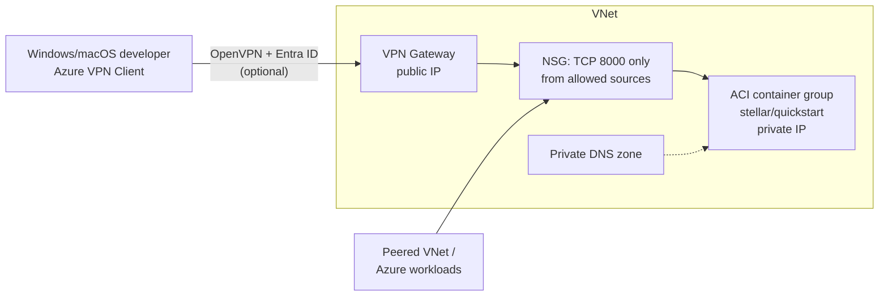

# terraform-azure-stellar-quickstart

Terraform module that runs the [Stellar Quickstart](https://github.com/stellar/quickstart)
image on Azure Container Instances, **private / internal by default**. The container
gets a private IP inside a VNet with no public exposure; an optional Point-to-Site
VPN gateway (Entra ID auth) provides access from outside Azure. The quickstart image
has no auth on any of its services (Friendbot included), so keeping it off the
open internet is the point of this design. A public mode
(`network_access = "public"`) exists for short-lived demos.



What's running behind port 8000: Horizon (`/`), Stellar RPC (`/rpc`),
Friendbot (`/friendbot`), and Lab.

> [!TIP]
> Consuming this from Azure DevOps with remote state, pipelines, and seeded
> test accounts? Start from the
> [stellar-quickstart-azure-starter](https://github.com/withobsrvr/stellar-quickstart-azure-starter)
> template instead of wiring it up by hand.

## Usage

Minimal — module creates the resource group, no VPN (access from inside/peered
VNets only):

```hcl
module "stellar_quickstart" {
  source = "git::https://github.com/withobsrvr/terraform-azure-stellar-quickstart.git?ref=v0.1.3"

  location        = "eastus"
  environment     = "dev"
  stellar_network = "local"
}
```

Existing resource group + VPN for laptop access:

```hcl
module "stellar_quickstart" {
  source = "git::https://github.com/withobsrvr/terraform-azure-stellar-quickstart.git?ref=v0.1.3"

  resource_group_name = "rg-obsrvr-shared-dev" # used as-is, not created
  enable_vpn_gateway  = true

  stellar_network  = "testnet"
  container_cpu    = 4
  container_memory = 16
}
```

Public demo — no VNet, public IP + FQDN, **everything internet-reachable**:

```hcl
module "stellar_quickstart" {
  source = "git::https://github.com/withobsrvr/terraform-azure-stellar-quickstart.git?ref=v0.1.3"

  location       = "eastus"
  network_access = "public"
  dns_name_label = "my-stellar-demo" # {label}.{region}.azurecontainer.io
}
```

Runnable versions of all three are in [`examples/`](examples/).

### Network access modes

- `network_access = "private"` (default): VNet-injected container, private IP
  only, NSG deny-by-default, private DNS zone. Reachable only from the VNet,
  peered VNets, or the optional VPN.
- `network_access = "public"`: **no VNet, no NSG, no private DNS** — the
  container gets a public IP and an `azurecontainer.io` FQDN. Horizon, RPC,
  Lab, and Friendbot are all open to the internet, unauthenticated. There is
  no middle ground in this mode, so treat it as demo-only and destroy promptly.
  Incompatible with `enable_vpn_gateway` (enforced with a precondition).

### Resource group behavior

- `resource_group_name = null` (default): the module creates
  `rg-{project_name}-{environment}`. `location` is **required** in this case
  (enforced with a precondition).
- `resource_group_name = "..."`: the module deploys into that existing group and
  defaults `location` to the group's location (settable explicitly to override).

### VPN behavior

`enable_vpn_gateway = false` (default) skips the GatewaySubnet, public IP,
gateway, and the NSG rule for VPN clients — nothing about the deployment is
internet-facing at all. Reach the endpoint from workloads in the VNet, or peer
your consumer VNet (use the `vnet_id` output) and add its CIDR to
`additional_allowed_cidrs`.

`enable_vpn_gateway = true` adds a P2S OpenVPN gateway with Entra ID auth.
Notes for this mode:

- The default audience is Microsoft's current registered Azure VPN Client app
  (`c632b3df-fb67-4d84-bdcf-b95ad541b5c8`), which does not require tenant
  admin consent. The older manually registered client is not used.
- By default, authentication is tenant-wide. For least-privilege access,
  create a custom audience application, require assignment, assign a dedicated
  developer group, and set `vpn_aad_audience` to that application's client ID.
- Entra authentication through Azure VPN Client is supported on Windows and
  macOS. Microsoft's Linux Azure VPN Client retired on August 31, 2026; Linux
  clients require a different authentication design such as certificates.
  See Microsoft's [P2S Entra configuration](https://learn.microsoft.com/azure/vpn-gateway/point-to-site-entra-gateway),
  [assigned-user/group access](https://learn.microsoft.com/azure/vpn-gateway/point-to-site-entra-users-access),
  and [Linux retirement guidance](https://learn.microsoft.com/azure/vpn-gateway/azure-vpn-client-linux-retirement).
- Set `vpn_authentication_type = "certificate"` and provide
  `vpn_root_certificate_data` to use standard OpenVPN clients on Linux instead.
  Only the public root certificate is uploaded; keep its private key offline.

- The gateway takes **30–45 minutes** to provision and costs roughly
  **$190/month** (VpnGw1AZ, region-dependent) while it exists.
- Client setup: install the Azure VPN Client, then generate the profile with
  `az network vnet-gateway vpn-client generate -g <rg> -n <vpn_gateway_name output>`
  and import `AzureVPN/azurevpnconfig.xml` from the downloaded zip.
- **DNS caveat:** P2S clients can't resolve the private DNS zone (Azure's
  resolver isn't reachable over the tunnel). Use the
  `container_group_private_ip` output directly, add a hosts-file entry, or
  deploy an Azure Private DNS Resolver inbound endpoint (out of scope here).

## Inputs

| Name | Type | Default | Description |
|---|---|---|---|
| `resource_group_name` | `string` | `null` | Existing resource group to deploy into; created when null |
| `location` | `string` | `null` | Region; required when creating the resource group, else defaults to the group's location |
| `network_access` | `string` | `"private"` | `private` (VNet, no public exposure) or `public` (demo-only, internet-open) |
| `dns_name_label` | `string` | `null` | Public FQDN label (public mode only); defaults to `{project_name}-{environment}` |
| `environment` | `string` | `"dev"` | Used in naming and tags |
| `project_name` | `string` | `"stellar-quickstart"` | Used in naming and tags |
| `enable_vpn_gateway` | `bool` | `false` | Deploy the P2S VPN gateway |
| `vnet_cidr` | `string` | `"10.10.0.0/16"` | VNet address space |
| `aci_subnet_cidr` | `string` | `"10.10.1.0/24"` | ACI subnet prefix |
| `gateway_subnet_cidr` | `string` | `"10.10.255.0/27"` | GatewaySubnet prefix (VPN only) |
| `vpn_client_address_pool` | `string` | `"172.16.201.0/24"` | P2S client pool (VPN only); must not overlap the VNet |
| `vpn_authentication_type` | `string` | `"entra"` | `entra` for Azure VPN Client on Windows/macOS, or `certificate` for standard OpenVPN clients including Linux |
| `vpn_gateway_sku` | `string` | `"VpnGw1AZ"` | VpnGw1AZ–VpnGw5AZ (Azure retired non-AZ SKUs) |
| `vpn_aad_audience` | `string` | Microsoft-registered client ID | Entra audience the VPN accepts; set a custom app ID for assigned-user/group access |
| `vpn_root_certificate_name` | `string` | `"stellar-p2s-root"` | Trusted root name in certificate mode |
| `vpn_root_certificate_data` | `string` | `null` | Base64 DER public root certificate; required in certificate mode |
| `additional_allowed_cidrs` | `list(string)` | `[]` | Extra CIDRs allowed to reach port 8000 (e.g. peered VNets) |
| `stellar_network` | `string` | `"local"` | `local`, `testnet`, or `futurenet` |
| `quickstart_image` | `string` | `stellar/quickstart:latest` | Pin a tag for reproducibility |
| `container_cpu` | `number` | `2` | Use 4 for testnet/futurenet |
| `container_memory` | `number` | `8` | GB; use 16 for testnet/futurenet |
| `private_dns_zone_name` | `string` | `"stellar.internal"` | Internal zone name |
| `dns_record_name` | `string` | `"quickstart"` | A record for the endpoint |
| `tags` | `map(string)` | `{}` | Merged onto all resources |

## Outputs

| Name | Description |
|---|---|
| `resource_group_name` | Resource group in use (created or supplied) |
| `stellar_endpoint` | Private DNS name (private mode) or public FQDN (public mode), with port |
| `container_group_private_ip` | Private IP; `null` in public mode |
| `container_group_public_ip` / `container_group_public_fqdn` | Public address; `null` in private mode |
| `vnet_id` / `vnet_name` | For peering consumer VNets; `null` in public mode |
| `private_dns_zone_id` | For linking additional VNets to the zone; `null` in public mode |
| `vpn_gateway_name` | For generating the VPN client profile; `null` when VPN disabled |
| `vpn_gateway_public_ip` | VPN endpoint IP; `null` when VPN disabled |

## Funding accounts with Friendbot

See [docs/FRIENDBOT.md](docs/FRIENDBOT.md) for how to create and fund accounts
on the deployment's network — curl, stellar-cli, and JavaScript examples,
plus which networks Friendbot is available on (`local` only).

## Notes

- **Ephemeral data**: a restart on `--local` starts a fresh network from
  genesis; on `testnet` it re-syncs. This matches the quickstart image's
  intended dev/test use. Needing persistence is the signal to move to a VM
  with a managed disk instead of ACI.
- **Egress is unrestricted** (needed for image pull and network sync).
- **Docker Hub throttling**: ACI pulls the image anonymously, and apply can
  fail with `409 RegistryErrorResponse ... Please retry later` from
  `index.docker.io`. Just re-run apply — the retry usually succeeds
  immediately.
- **Costs (East US, approximate)**: ACI 2 vCPU / 8 GB ~$100/mo; VPN gateway
  (when enabled) ~$190/mo + ~$4 for its public IP.
- The `azurerm` provider is configured by the caller, not the module; azurerm
  4.x needs `ARM_SUBSCRIPTION_ID` (or `subscription_id`) set.
